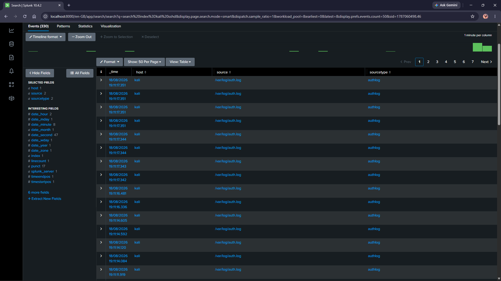
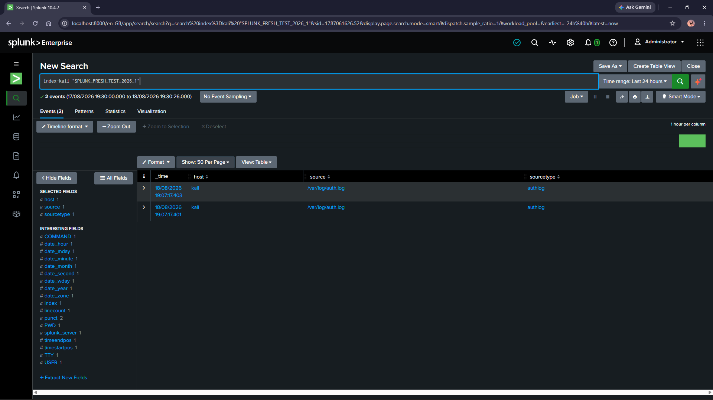
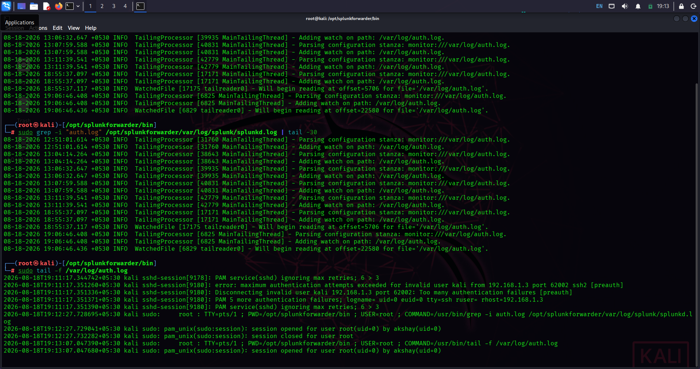

# Splunk SIEM Home Lab – Linux Log Monitoring & SSH Brute-Force Detection


A hands-on Security Operations Center (SOC) lab demonstrating centralized log collection, security event monitoring, and detection of SSH brute-force attacks using **Splunk**.

---

## 📖 Overview

This project simulates a small-scale SOC monitoring environment. A **Kali Linux** endpoint is configured as a monitored host, and a **Windows** machine running **Splunk** acts as the central SIEM. A Splunk Universal Forwarder collects Linux authentication and system logs and forwards them to Splunk over **TCP 9997**.

Controlled SSH brute-force activity is then generated in the lab to validate that authentication failures are successfully collected, indexed, searched, and flagged as potential attack activity — covering the full lifecycle from log generation to detection.

---

## 🎯 Objectives

- Configure a Splunk Universal Forwarder on Linux
- Forward Linux authentication and system logs to Splunk
- Configure Splunk to receive events on TCP 9997
- Create and verify a dedicated Splunk index
- Monitor SSH authentication activity
- Simulate controlled SSH brute-force activity
- Verify attack-related events in Splunk
- Develop a foundation for SIEM detection and alerting

---

## 🏗️ Lab Architecture

```text
                         SOC Monitoring Environment

┌──────────────────────────┐
│      Kali Linux Clone    │
│      192.168.1.98        │
│                           │
│  /var/log/auth.log        │
│  /var/log/syslog          │
└────────────┬──────────────┘
             │
             │ Splunk Universal Forwarder
             │ TCP/9997
             ▼
┌──────────────────────────┐
│      Windows Host         │
│      192.168.1.3          │
│                           │
│        Splunk SIEM        │
│      TCP Receiver 9997    │
└────────────┬──────────────┘
             │
             ▼
       ┌──────────────┐
       │  index=kali  │
       └──────────────┘
             │
             ▼
     Security Monitoring
             │
             ▼
   SSH Brute-Force Detection
```

---

## 🧰 Lab Environment

| Component | Details |
|---|---|
| SIEM | Splunk |
| Log Forwarder | Splunk Universal Forwarder |
| Endpoint | Kali Linux |
| Endpoint IP | `192.168.x.xx` |
| Splunk Server | Windows |
| Splunk Server IP | `192.168.x.x` |
| Forwarding Port | TCP `9997` |
| Log Source | `/var/log/auth.log` |
| Secondary Log Source | `/var/log/syslog` |
| Splunk Index | `kali` |
| Sourcetype | `authlog` |

---

## ⚙️ 1. Configure Splunk Universal Forwarder

The Splunk Universal Forwarder was installed on the Kali Linux endpoint and configured to send events to the Splunk server at `192.168.x.x:9997`.

Verified using:

```bash
sudo ./splunk list forward-server
```

**Expected result:**

```text
Active forwards:
        192.168.x.x:9997

Configured but inactive forwards:
        None
```

---

## 📂 2. Configure Log Monitoring

The following Linux logs were configured for collection:

```text
/var/log/auth.log
/var/log/syslog
```

Verified using:

```bash
sudo ./splunk list monitor
sudo ./splunk btool inputs list --debug
```

Example configuration (`inputs.conf`):

```ini
[monitor:///var/log/auth.log]
disabled = false
index = kali
sourcetype = authlog
```

---

## 🌐 3. Verify Network Connectivity

The Splunk receiver was configured to listen on TCP port `9997`. Connectivity from the Kali endpoint was tested using:

```bash
nc -vz 192.168.1.3 9997
```

Successful connectivity was confirmed, and the forwarder logs verified the connection:

```text
Connected to idx=192.168.1.3:9997
```

---

## ✅ 4. Validate Log Collection

A controlled test event was generated on the Kali endpoint:

```bash
sudo logger -p authpriv.warning "SPLUNK_FRESH_TEST_2026_1"
```

Verified locally:

```bash
sudo tail -5 /var/log/auth.log
```

```text
root: SPLUNK_FRESH_TEST_2026_1
```

Then searched for in Splunk:

```text
index=kali "SPLUNK_FRESH_TEST_2026_1"
```

**Result:** The test event was successfully received and indexed by Splunk.

---

## 🔐 5. SSH Authentication Monitoring

SSH authentication events were monitored through the `auth.log` data source.

```text
index=kali sshd
```

Examples of relevant events include:

- `Invalid user`
- `Failed password`
- `authentication failure`
- `Connection closed`

---

## 💥 6. Controlled SSH Brute-Force Simulation

A controlled SSH authentication test was performed against the Kali lab endpoint using Hydra with a small test wordlist to avoid unnecessary traffic.

```bash
printf "wrong1\nwrong2\nwrong3\nwrong4\nwrong5\n" > /tmp/test.txt
hydra -l kali -P /tmp/test.txt ssh://192.168.1.98
```

The resulting SSH authentication failures were written to `/var/log/auth.log` and subsequently forwarded to Splunk.

---

## 🚨 7. Detecting SSH Brute-Force Activity

Failed SSH authentication attempts can be identified with:

```text
index=kali sshd ("Failed password" OR "Invalid user")
```

A basic threshold-based detection:

```text
index=kali sshd ("Failed password" OR "Invalid user")
| stats count by src_ip
| where count >= 5
```

This can be configured as a scheduled Splunk alert.

**Detection Logic**

```text
Multiple SSH authentication failures
              ↓
        Same source IP
              ↓
       Threshold exceeded
              ↓
     Potential brute-force attack
              ↓
         Splunk Alert
```

---

## 🖼️ 8. Evidence & Screenshots

> Screenshots are stored in the `screenshots/` folder. Replace the placeholder paths below with your actual filenames if they differ.

**Splunk Forwarder Status** — shows the Universal Forwarder successfully connected to `192.168.1.3:9997`


**Monitored Log Files** — shows `/var/log/auth.log` and `/var/log/syslog` being monitored by the forwarder



**Test Event Generated on Kali** — shows the controlled test event being written to `/var/log/auth.log`


**Test Event in Splunk** — Splunk successfully retrieves `index=kali "SPLUNK_FRESH_TEST_2026_1"`



**SSH Authentication Events** — SSH authentication activity collected from the Kali endpoint



**Brute-Force Detection** — multiple failed SSH authentication attempts detected in Splunk


---

## 🔑 Key Findings

- Linux authentication logs can be centrally collected using Splunk Universal Forwarder
- Events can be transmitted from Kali Linux to Splunk over TCP 9997
- Custom Splunk indexes can be used to organize endpoint telemetry
- SSH authentication activity can be searched and analyzed centrally
- Controlled brute-force activity generates detectable authentication events
- Repeated authentication failures can be used as a basis for SIEM detection rules

---

## 🧠 Skills Demonstrated

**SIEM & SOC**
- Splunk
- Log ingestion
- Event analysis
- Detection engineering
- Alert configuration
- Security monitoring

**Linux**
- Linux authentication logs (`auth.log`, `syslog`)
- System administration
- Service troubleshooting

**Networking**
- TCP/UDP concepts
- Splunk forwarding
- TCP 9997
- Network connectivity troubleshooting

**Security**
- SSH authentication monitoring
- Brute-force detection
- Attack simulation in a controlled lab
- Security event investigation

---

## 📚 Lessons Learned

This project provided practical experience with the complete lifecycle of security telemetry:

```text
Generate Event → Collect → Forward → Receive → Index → Search → Detect → Alert → Investigate
```

One of the key troubleshooting lessons was **verifying each layer independently** rather than assuming that a successful network connection meant that logs were being indexed correctly.

---

## 🚀 Future Improvements

- [ ] Create a Splunk dashboard for SSH authentication activity
- [ ] Build automated brute-force alerts
- [ ] Add source IP extraction and enrichment
- [ ] Detect successful logins following multiple failures
- [ ] Monitor privilege escalation events
- [ ] Monitor suspicious sudo activity
- [ ] Add Windows security logs
- [ ] Add Sysmon telemetry
- [ ] Integrate additional endpoints
- [ ] Create MITRE ATT&CK-mapped detections
- [ ] Develop incident investigation workflows

---

## 📁 Repository Structure

```text
Splunk-SIEM-Home-Lab/
│
├── README.md
│
├── screenshots/
│   ├── forwarder-status.png
│   ├── monitored-logs.png
│   ├── kali-test-event.png
│   ├── splunk-test-event.png
│   ├── ssh-events.png
│   └── bruteforce-detection.png
│
└── configs/
    └── inputs.conf
```

---

## ⚠️ Disclaimer

This project was performed in a controlled home laboratory environment for cybersecurity learning and defensive security testing. All attack simulations were conducted against systems owned or explicitly authorized for testing.

---

## 👤 Author

**Akshay Suresh**
Cybersecurity Student | Penetration Testing & SOC

- GitHub: [Akshayy-y](https://github.com/Akshayy-y)
- LinkedIn: [Akshay Suresh](https://www.linkedin.com/in/akshay-suresh-a04202283/)
